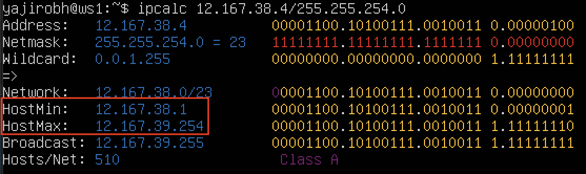
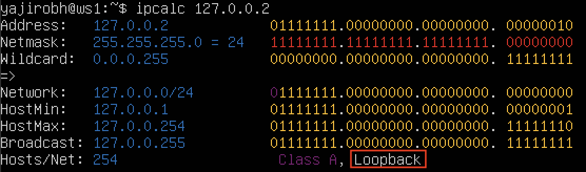
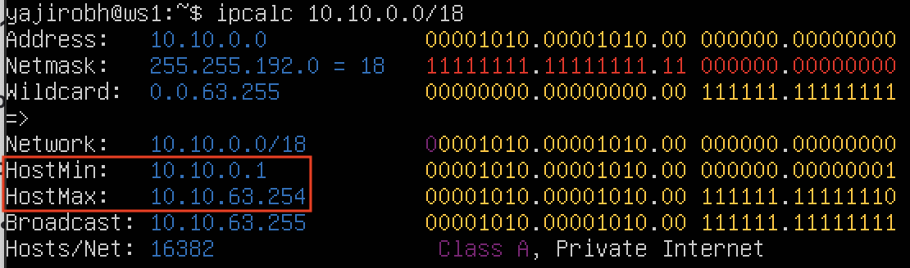
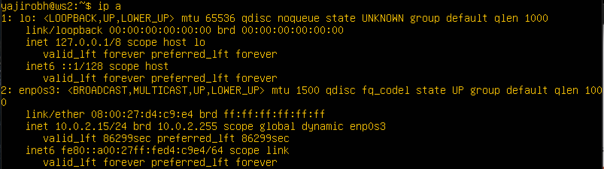
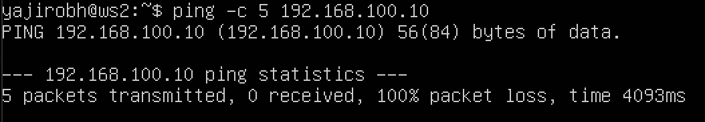
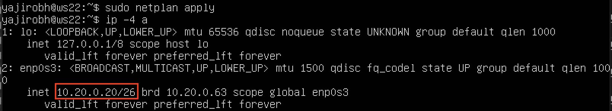
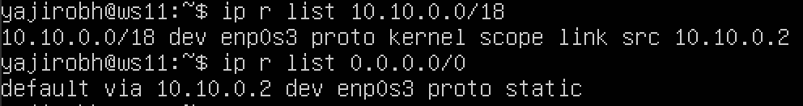
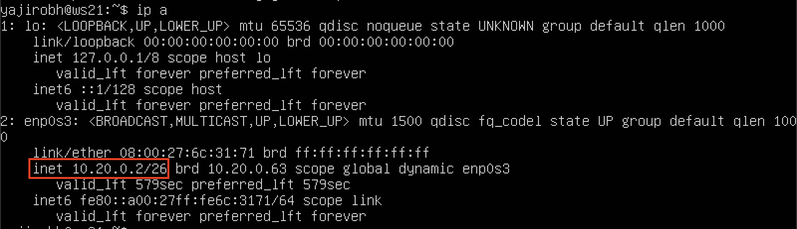

# **ОТЧЁТ**

## **Part 1. Инструмент ipcalc**
- Поднимаем виртуальную машину `ws1`:\

- Для выполнения задания устанавливаем и используем утилиту `ipcalc`:\

### **1.1. Сети и маски**
1) Определяем адрес сети `192.167.38.54/13`:\
	\
	Адрес - `192.167.38.54`
2) Перевод маски `255.255.255.0` в префиксную и двоичную запись:\
	\
	Префиксная запись - `/24`\
	Двоичная запись - `11111111.11111111.11111111.00000000`
- Перевод маски `/15` в обычную и двоичную запись:\
	\
	Обычная запись - `255.254.0.0`\
	Двоичная запись - `11111111.11111110.00000000.00000000`
- Перевод маски `11111111.11111111.11111111.11110000` в обычную и префиксную запись:\
	\
	Для использования `ipcalc` с маской в двоичном виде берём любой адрес (в нашем случае - `0.0.0.0`) и префикс `/28` - количество единиц в исходной маске\
	Обычная запись - `255.255.255.240`\
	Префиксная запись - `/28`
3) Минимальный и максимальный хост в сети `12.167.38.4` при масках:
- `/8`:\
	\
	HostMin - `12.0.0.1`\
	HostMax - `12.255.255.254`
- `11111111.11111111.00000000.00000000 (/16)`:\
	\
	HostMin - `12.167.0.1`\
	HostMax - `12.167.255.254`
- `255.255.254.0`:\
	\
	HostMin - `12.167.38.1`\
	HostMax - `12.167.39.254`
- `/4`:\
	\
	HostMin - `0.0.0.1`\
	HostMax - `15.255.255.254`
### **1.2. localhost**
- Адреса `localhost` находятся в диапазоне `127.0.0.1 — 127.255.255.254`. Соответственно обратиться можно к приложениям с IP: `127.0.0.2, 127.1.0.1`, а с IP: `194.34.23.100, 128.0.0.1` - нет
- Используя утилиту `ipcalc` это можно определить по наличию или отсутствию записи `loopback` в строке `Hosts/Net`:
	- `194.34.23.100` - нет:\
	
	- `127.0.0.2` - да:\
	
	- `127.1.0.1` - да:\
	
	- `128.0.0.1` - нет:\
	
### **1.3. Диапазоны и сегменты сетей**
1) Частные адреса находятся в трёх диапазонах:\
	`10.0.0.0 – 10.255.255.255`\
	`172.16.0.0 – 172.31.255.255`\
	`192.168.0.0 – 192.168.255.255`
- Соответственно адреса: `10.0.0.45`, `192.168.4.2`, `172.20.250.4`, `172.16.255.255`, `10.10.10.10` являются частными, а адреса: `134.43.0.2`, `172.0.2.1`, `192.172.0.1`, `172.68.0.2`, `192.169.168.1`  - публичными
- Используя утилиту `ipcalc` это можно определить по наличию или отсутствию записи `Private Internet` в строке `Hosts/Net`:
	- `10.0.0.45` - частный:\
	
	- `134.43.0.2` - публичный:\
	
	- `192.168.4.2` - частный:\
	
	- `172.20.250.4` - частный:\
	
	- `172.0.2.1` - публичный:\
	
	- `192.172.0.1` - публичный:\
	
	- `172.68.0.2` - публичный:\
	
	- `172.16.255.255` - частный:\
	
	- `10.10.10.10` - частный:\
	
	- `192.169.168.1` - публичный:\
	
2) Чтобы определить, какие IP-адреса шлюза возможны у сети `10.10.0.0/18`, нам нужны строки `HostMin` и `HostMax`:\
	
- Соответственно, из перечисленных IP-адресов у сети `10.10.0.0/18` возможны адреса, которые входят в диапазон `10.10.0.1 - 10.10.63.254`, а именно: `10.10.0.2`, `10.10.10.10`, `10.10.1.255`

## **Part 2. Статическая маршрутизация между двумя машинами**
- Поднимаем вторую виртуальную машину `ws2`:\

- Существующие сетевые интерфейсы:
	- **ws1:**\
	
	- **ws2:**\
	
- Описание сетевых интерфейсов:
	- На каждой виртуальной машине открываем файл через `sudo vim /etc/netplan/00-installer-config.yaml` и добавляем необходимые настройки:
		- **ws1:**\
		
		- **ws2:**\
		
	- Сохраняем через `:wq`. Проверяем изменения:
		- **ws1:**\
		
		- **ws2:**\
		
	- Перезапускаем сервис сети:
		- **ws1:**\
		
		- **ws2:**\
		
### **2.1. Добавление статического маршрута вручную**
- Командой вида `ip r add` добавляем статический маршрут от одной машины до другой и обратно:
	- **ws1:**\
	
	- **ws2:**\
	
- Пингуем соединение между машинами:
	- **ws1:**\
	
	- **ws2:**\
	
### **2.2. Добавление статического маршрута с сохранением**
- Перезапускаем машины - `reboot`
- На каждой виртуальной машине открываем файл через `sudo vim /etc/netplan/00-installer-config.yaml` и добавляем маршруты:
	- **ws1:**\
	
	- **ws2:**\
	
- Сохраняем через `:wq`. Проверяем изменения:
	- **ws1:**\
	
	- **ws2:**\
	
- Перезапускаем сервис сети:
	- **ws1:**\
	
	- **ws2:**\
	
- Пингуем соединение между машинами:
	- **ws1:**\
	
	- **ws2:**\
	

## **Part 3. Утилита iperf3**
### **3.1. Скорость соединения**
- Перевод:
	- 8 Mbps = 1 MB/s
	- 100 MB/s = 100000 Kbps
	- 1 Gbps = 1000 Mbps
### **3.2. Утилита iperf3**
- Устанавливаем утилиту `iperf3` - `sudo apt install iperf3`
- Для использования `iperf3` необходимо, чтобы одна машина выступала в качестве сервера, а другая - в качестве клиента
- Роль сервера будет выполнять `ws1`, для этого на машине запускаем `iperf3 -s`:\

- На машине `ws2` (клиент) запускаем `iperf3 -c 192.168.100.10`:\

## **Part 4. Сетевой экран**
### **4.1. Утилита iptables**
- Создаём файл `firewall.sh` на каждой машине и добавляем правила:
	- **ws1:**\
		\
		
	- **ws2:**\
		\
		
- Сначала на каждой машине открываем доступ для `порта 22 (ssh)` и `порта 80 (http)`. Затем добавляем правила о блокировке (`REJECT`) и разрешении (`ACCEPT`) `echo reply` на машине `ws1`, на `ws2` делаем то же самое, но в обратном порядке
- Сохраняем через `:wq`
- Запускаем файлы на обеих машинах:
	- **ws1:**\
		
	- **ws2:**\
		
- Суть правил в `firewall.sh` заключается в том, что применяется первое подходящее правило пока не встретится запрет. В первом случае, когда мы сначала запретили `echo reply`, а затем разрешили, будем применено правило о блокировке (`REJECT`), а правило о разрешении (`ACCEPT`) будет проигнорировано. Во втором же случае - наоборот: оба правила применятся
### **4.2. Утилита nmap**
- Устанавливаем утилиту `nmap` - `sudo apt install nmap`
- Пингуем обе машины и ищем машину, которая не пингуется:
	- **ws1:**\
		
	- **ws2:**\
		
- Видим, что пинг с `ws2` на `ws1` не проходит. Значит `ws1` не пингуется
- Запускаем `nmap` и видим, что хост машины запущен:\

- Сохраняем дампы образов виртуальных машин:\

## **Part 5. Статическая маршрутизация сети**
- Поднимаем 5 виртуальных машин:\

### **5.1. Настройка адресов машин**
- Настраиваем конфигурации машин:
	- **ws11:**\
		
	- **ws21:**\
		
	- **ws22:**\
		
	- **r1:**\
		
	- **r2:**\
		
- Перезапускаем сервис сети и проверяем, что адрес машины задан верно:
	- **ws11:**\
		
	- **ws21:**\
		
	- **ws22:**\
		
	- **r1:**\
		
	- **r2:**\
		
- Пингуем `ws22` с `ws21`:\

- Пингуем `r1` с `ws11`:\

### **5.2. Включение переадресации IP-адресов**
- Включаем переадресацию IP:
	- **r1:**\
		
	- **r2:**\
		
- Изменяем файл `/etc/sysctl.conf`:
	- **r1:**\
		
	- **r2:**\
		
### **5.3. Установка маршрута по-умолчанию**
- Настраиваем маршрут по-умолчанию для рабочих станций:
	- **ws11:**\
		
	- **ws21:**\
		
	- **ws22:**\
		
- Ищем маршрут в таблице маршрутизации:
	- **ws11:**\
		
	- **ws21:**\
		
	- **ws22:**\
		
- Перед пингом `r2` с `ws11` нужно установить связь между роутерами:\
\

- Теперь пингуем `r2` с `ws11`:\

- Проверяем, что пинг доходит:\

### **5.4. Добавление статических маршрутов**
- Добавляем в роутеры статические маршруты:
	- **r1:**\
		
	- **r2:**\
		
- Проверяем маршруты:
	- **r1:**\
		
	- **r2:**\
		
- Запускаем команды `ip r list 10.10.0.0/[маска сети]` и `ip r list 0.0.0.0/0`:\
	
- Маршрут по умолчанию используется тогда, когда нет другого заданного маршрута, т.е. у такого маршрута наименьший приоритет. Т.к. мы задали правило для сети `10.10.0.0`, то он будет идти по заданному маршруту
### **5.5. Построение списка маршрутизаторов**
- Запускаем на `r1` команду дампа:\

- При помощи утилиты `traceroute` строим список маршрутизаторов от `ws11` до `ws21`:\

- `traceroute` предоставляет информацию о пути пакета данных из одной точки сети на конкретный IP-сервер. Когда данные передаются между двумя точками, они должны проходить через несколько устройств (в нашем случае - `r1` и `r2`). Утилита отправляет 3 UDP-пакета на определенный порт целевого хоста и ожидает ответа о недоступности этого порта. Первый пакет отправляется с TTL = 1, второй с TTL = 2 и так далее, пока запрос не попадет адресату. При TTL = 1 traceroute, получая ответ от первого маршрутизатора, определяет его IP-адрес и время, затраченное на обработку пакета. После этого TTL увеличивается на единицу для определения следующего маршрутизатора, и так далее до момента попадания пакета на целевой хост. Утилита использует указанный ей IP-адрес, и порт 34434 по умолчанию. Целевой хост принимает пакет, и отправляет сообщение о недоступности порта 34434 (так как в большинстве случаев он не используется каким-либо сервисом и закрыт). В итоге отслеживается вся цепочка следования пакета, которая завершается ответом от целевого хоста
### **5.6. Использование протокола ICMP при маршрутизации**
- Запускаем на `r1` перехват сетевого трафика:\

- Пингуем с `ws11` несуществующий IP:\

- Вывод `tcpdump`:\

- Сохраняем дампы виртуальных машин:\

## **Part 6. Динамическая настройка IP с помощью DHCP**
- Перед настройкой устанавливаем службу DHCP - `sudo apt install isc-dhcp-server`
- Настраиваем конфигурацию службы DHCP для машины `r2`:\

- В файле `resolv.conf` прописываем `nameserver 8.8.8.8`:\

- Перезагружаем службу DHCP и проверяем статус:\

- Чтобы машина `ws21` получила новый адрес от `r2` нужно внести изменения в конфигурационный файл:\

- Перезагружаем `ws21` и проверяем, что адрес дошёл:\
\

- Пингуем `ws22` с `ws21`:\

- Добавляем MAC-адрес у `ws11`:\
\

- Делаем аналогичные `r2` настройки у `r1`, но с жесткой привязкой к MAC-адресу и перезапускаем сервер:\
\
\

- Перезагружаем `ws11` и проверяем адрес:\
\

- Пингуем `ws21` с `ws11`:\

- Смотрим текущий IP-адрес `ws21`:\

- Перед обновлением IP-адреса удаляем текущий адрес и проверяем, что адреса нет:\

- Запрашиваем новый IP-адрес и проверяем:\

- Утилита `dhclient` используется для управления адресом. Флаг `-r` освобождает текущий адрес, а команда без флага задаёт новый IP-адрес
- Сохраняем дампы виртуальных машин:\

## **Part 7. NAT**
- Изменяем файл `/etc/apache2/ports.conf`:
	- **ws22:**\
		
	- **r1:**\
		
- Запускаем сервер `Apache`:
	- **ws22:**\
		
	- **r1:**\
		
- Создаём на `r2` файл `firewall.sh` и добавляем в него правила:\

- Запускаем фаерволл:\

- Проверяем соединение между `ws22` и `r1`. Видим, что соединение не проходит:\

- Добавляем новое правило в `firewall.sh`:\

- Запускаем фаерволл:\

- Проверяем соединение между `ws22` и `r1`. Видим, что в этот раз соединение проходит:\

- Добавляем ещё два правила в `firewall.sh`:\

- Запускаем фаерволл:\

- На `ws22` проверяем соединение по TCP для SNAT:\

- На `r1` проверяем соединение по TCP для DNAT:\

- Сохраняем дампы виртуальных машин:\

## **Part 8. Дополнительно. Знакомство с SSH Tunnels**
- Запускаем `firewall.sh` на `r2`:\
\

- Запускаем сервер Apache на `ws22` и изменяем файл `/etc/apache2/ports.conf`:\
\

- Используем `Local TCP forwarding (-L)`, чтобы с `ws21` получить доступ к веб-серверу на `ws22`:\

- Проверяем, что соединение сработало:\

- Используем `Remote TCP forwarding (-R)`, чтобы c `ws11` получить доступ к веб-серверу на `ws22`:\

- Проверяем, что соединение сработало:\

- Сохраняем дампы виртуальных машин:\
